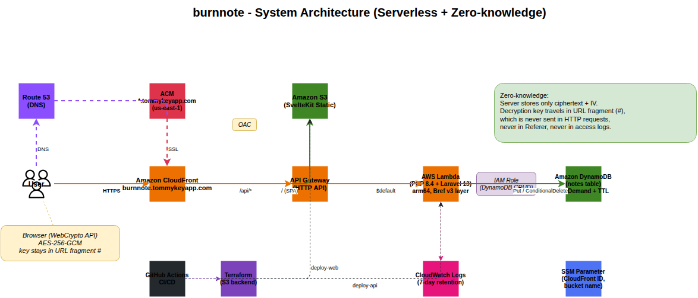

# burnnote

1 回読んだら消える秘密共有サービス。ブラウザ側で AES-256-GCM 暗号化し、サーバーは暗号文しか知らないゼロ知識設計。

🌐 **[https://burnnote.tommykeyapp.com](https://burnnote.tommykeyapp.com)**
📖 **[API ドキュメント (Swagger UI)](https://tommykey-apps.github.io/burnnote/)**

## 構成図



> [docs/architecture.drawio](docs/architecture.drawio) を draw.io で開くと編集できます。

## 使った技術

| | |
|---|---|
| バックエンド | PHP 8.4 + Laravel 13 + Bref v3 (Lambda, arm64) |
| フロント | SvelteKit 2, Svelte 5, Tailwind CSS v4, mode-watcher |
| i18n | 自作 (Svelte 5 `$state` + JSON 辞書、日本語 / 英語) |
| DB | DynamoDB (On-Demand + TTL) |
| 暗号化 | AES-256-GCM (WebCrypto API)、鍵は URL fragment |
| コンピュート | Lambda (arm64, `arm-php-84` Bref v3 unified layer, `BREF_RUNTIME=fpm`) |
| API | API Gateway HTTP API |
| IaC | Terraform (S3 backend + DynamoDB state lock) |
| CI/CD | GitHub Actions (setup-php + pnpm + `dorny/paths-filter`) |
| テスト | PHPUnit (Feature), Playwright (E2E) |
| 配信 | CloudFront (S3 + API Gateway デュアルオリジン, PriceClass_200) |

## 使ってる AWS サービス

| サービス | 役割 |
|---|---|
| **Lambda** | Laravel API をサーバーレス実行 (arm64, Bref v3 unified layer) |
| **API Gateway** (HTTP API) | `$default` ルートで Lambda に全委譲 (REST API より ~70% 安) |
| **DynamoDB** | ノートの暗号文を保存、`expires_at` TTL で自動削除 (On-Demand) |
| **CloudFront** | SPA + API の配信、SSL 終端 (PriceClass_200) |
| **S3** | SvelteKit 静的ファイル配信 (OAC 経由で CloudFront のみアクセス可) |
| **Route53** | `burnnote.tommykeyapp.com` の DNS (既存 hosted zone を data source で参照) |
| **ACM** | ワイルドカード証明書 `*.tommykeyapp.com` (us-east-1、既存) |
| **SSM Parameter Store** | CI/CD から参照する CloudFront Distribution ID / S3 bucket 名 / Lambda 関数名 |
| **CloudWatch Logs** | Lambda ログ (7 日保持) |
| **IAM** | Lambda 実行ロール (DynamoDB CRUD 最小権限) |

## API エンドポイント

| Method | Path | 機能 | ステータス |
|---|---|---|---|
| `POST` | `/api/notes` | 暗号文と IV を保存し ID を返す | `201` / `422` (validation) / `429` (rate limit) |
| `GET` | `/api/notes/{id}/exists` | 存在確認のみ (削除しない、プレビュー用) | `200` / `404` |
| `GET` | `/api/notes/{id}` | 暗号文と IV を返して即削除 (1-shot) | `200` / `410` Gone |
| `GET` | `/health` | ヘルスチェック | `200` |

レート制限: `throttle:10,1` (クライアント IP で毎分 10 リクエスト)。

## ゼロ知識暗号化の流れ

1. 作成者のブラウザが **WebCrypto API** で AES-256-GCM 鍵を生成
2. 平文を鍵で暗号化 → `{ciphertext, iv}` を `POST /api/notes` へ
3. サーバーは暗号文のみを DynamoDB に保存 (**鍵は受け取らない**)
4. レスポンスの `id` を受けて URL を組み立て:
   `https://burnnote.tommykeyapp.com/s/{id}#{key_base64url}`
   - **`#` 以降 (fragment) はブラウザ内部のみで処理され、HTTP リクエスト・Referer・アクセスログに載らない**
5. 共有相手がアクセス → `GET /api/notes/{id}` でサーバーが暗号文を返しつつ **条件付き DeleteItem で同一 request 内で削除**
6. ブラウザが fragment の鍵で復号 → 平文表示
7. 未読のまま放置された場合も、`expires_at` TTL (最大 7 日) で DynamoDB 側が自動削除

## ディレクトリ構成

```
burnnote/
├── api/                       # Laravel 13 (PHP 8.4) + Bref v3
│   ├── app/Http/Controllers/NoteController.php
│   ├── app/Services/NoteRepository.php
│   ├── app/Providers/AppServiceProvider.php
│   ├── routes/api.php
│   └── tests/Feature/NoteTest.php
├── web/                       # SvelteKit 2 (Svelte 5)
│   ├── src/routes/+layout.svelte          # ヘッダー + テーマトグル + 言語切替
│   ├── src/routes/+page.svelte            # 作成画面
│   ├── src/routes/s/[id]/+page.svelte     # 復号画面
│   ├── src/lib/crypto.ts                  # WebCrypto AES-256-GCM
│   ├── src/lib/api.ts                     # fetch ラッパ
│   ├── src/lib/i18n/{en,ja}.json + index.svelte.ts
│   └── src/lib/components/{ThemeToggle,LocaleSwitcher}.svelte
├── infra/                     # Terraform
│   ├── lambda.tf              # arm64 + Bref v3 layer + IAM
│   ├── dynamodb.tf            # On-Demand + TTL
│   ├── apigateway.tf          # HTTP API + $default
│   ├── cloudfront.tf          # S3 + API GW デュアルオリジン
│   ├── dns.tf                 # Route53 + ACM data source
│   └── ssm.tf / outputs.tf / variables.tf / versions.tf / backend.tf
├── docs/
│   ├── architecture.drawio    # 編集可能な構成図
│   ├── architecture.svg       # README 埋め込み用
│   └── swagger.yaml           # OpenAPI 3.1 仕様
├── .github/workflows/
│   ├── ci.yaml                # PR: test-api + build-web + e2e-web
│   ├── cd.yaml                # main: paths-filter → infra/api/web 個別デプロイ
│   └── pages.yaml             # docs/swagger.yaml 更新で Swagger UI 公開
├── docker-compose.yml         # DynamoDB Local
├── .flox/env/manifest.toml    # php84, composer, nodejs, pnpm, terraform, awscli2
└── CLAUDE.md
```

## ローカルで動かす

```bash
flox activate                                       # php84 / composer / node / pnpm / terraform / awscli2
docker compose up -d                                # DynamoDB Local (port 8000)
aws dynamodb create-table \
  --table-name burnnote \
  --attribute-definitions AttributeName=id,AttributeType=S \
  --key-schema AttributeName=id,KeyType=HASH \
  --billing-mode PAY_PER_REQUEST \
  --endpoint-url http://localhost:8000 --region ap-northeast-1
cd api && composer install && php artisan serve --port=8080 &
cd web && pnpm install && pnpm dev                  # port 5173, /api → :8080 を proxy
```

開けるアドレス: `http://localhost:5173/`

### テスト

```bash
cd api && php artisan test                          # Feature tests (9 件、モック利用)
cd web && pnpm test:e2e                             # Playwright E2E (要 api + web 起動)
```

## AWS にデプロイ

初回のみ:

```bash
cd infra && terraform init && terraform apply       # 20 リソース、CloudFront で ~3 分
```

以降は main への merge でフロント / API / インフラが自動デプロイされる (`cd.yaml` が `dorny/paths-filter` で差分検知)。

## コストについて

個人利用 (月数十〜数百リクエスト) で **実質 $0〜$0.5/月**:

| サービス | 想定使用量 | 想定コスト |
|---|---|---|
| Lambda (arm64, 512 MB, 数百 req) | 無料枠 100 万 req/月 内 | $0 |
| DynamoDB (On-Demand, 小規模) | 無料枠 25 GB + 25 WCU/RCU 内 | $0 |
| API Gateway HTTP API | 最初の 12 ヶ月は無料枠内 | $0 |
| CloudFront | 無料枠 1 TB/月 内 | $0 |
| S3 + Route53 hosted zone | 数 MB + $0.50 (hosted zone は既存で 0) | $0〜$0.50 |

**$150/月の EKS を避けた**のがこの構成の肝。

## セキュリティ面

- **ゼロ知識**: サーバー (Lambda / DynamoDB / CloudFront) は暗号文と IV しか見ない。鍵は URL fragment (`#` 以降) に載せて、HTTP リクエスト・Referer・アクセスログ・CDN ログに一切含まれない
- **1-shot 削除**: 読み取りは DynamoDB の **条件付き DeleteItem** で 1 リクエスト / 1 アトミック操作。レース無しで「2 回目は 410」を保証
- **TTL**: 未読放置の暗号文は `expires_at` で DynamoDB 側が自動削除 (最大 7 日、遅延は AWS 仕様で最大 48 時間あるが読み取り側で `expires_at > now` をフィルタするので見かけ上は即時)
- **Rate limit**: `throttle:10,1` で同一 IP からの爆撃を抑制
- **最小権限 IAM**: Lambda は対象テーブルの `GetItem/PutItem/DeleteItem/UpdateItem` のみ許可
- **ステートレス**: `SESSION_DRIVER=array`, `DB_CONNECTION=null`, `QUEUE_CONNECTION=sync` で Cookie / DB / キュー不使用
- **HTTPS 強制**: CloudFront の `viewer_protocol_policy = redirect-to-https`

## 運用メモ

- Bref v3 layer (account `873528684822`, `arm-php-84:17`) を使用。v2 (account `534081306603`) は AL2 ベースで `provided.al2023` と互換性がないので注意
- Lambda の `BREF_RUNTIME=fpm` 環境変数が必須 (v3 は unified layer 方式)
- APP_KEY は `random_password` で Terraform state に保存 (常時同じ値、ログイン / セッション機能は使っていないので実質ダミー)
- CD の `update-function-code` 直後は `aws lambda wait function-updated` で同期待ちしてから config 更新 (`ResourceConflictException` 回避)
