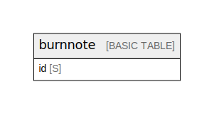

# Amazon DynamoDB (ap-northeast-1)

## Tables

| Name                    | Attributes | Comment                                                                                                                                                                                                                                                                                                               | Type        |
| ----------------------- | ---------- | --------------------------------------------------------------------------------------------------------------------------------------------------------------------------------------------------------------------------------------------------------------------------------------------------------------------- | ----------- |
| [burnnote](burnnote.md) | 1          | One-time Secret single table. Stores AES-256-GCM ciphertext + IV. TTL on `expires_at` (Number, Unix timestamp) deletes items asynchronously. `consume()` performs an atomic deleteItem with ConditionExpression to ensure one-time read semantics. See ../entities.md and ../access-patterns.md.  | BASIC TABLE |

## Relations

---

> Generated by [tbls](https://github.com/k1LoW/tbls)
