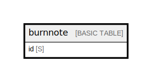

# burnnote

## Description

One-time Secret single table. Stores AES-256-GCM ciphertext + IV.  
TTL on `expires_at` (Number, Unix timestamp) deletes items asynchronously.  
`consume()` performs an atomic deleteItem with ConditionExpression to ensure  
one-time read semantics. See ../entities.md and ../access-patterns.md.  

## Attributes

| Name | Type | Default | Nullable | Children | Parents | Comment                                                                                                                              |
| ---- | ---- | ------- | -------- | -------- | ------- | ------------------------------------------------------------------------------------------------------------------------------------ |
| id   | S    |         | false    |          |         | Partition key. URL-safe base64 of 16 random bytes (`\Random\Randomizer`). Used as the public note ID in the URL fragment.  |

## Primary Key

| Name        | Type          | Definition                                 |
| ----------- | ------------- | ------------------------------------------ |
| Primary Key | Partition key | [{ AttributeName: "id", KeyType: "HASH" }] |

## Relations

---

> Generated by [tbls](https://github.com/k1LoW/tbls)
